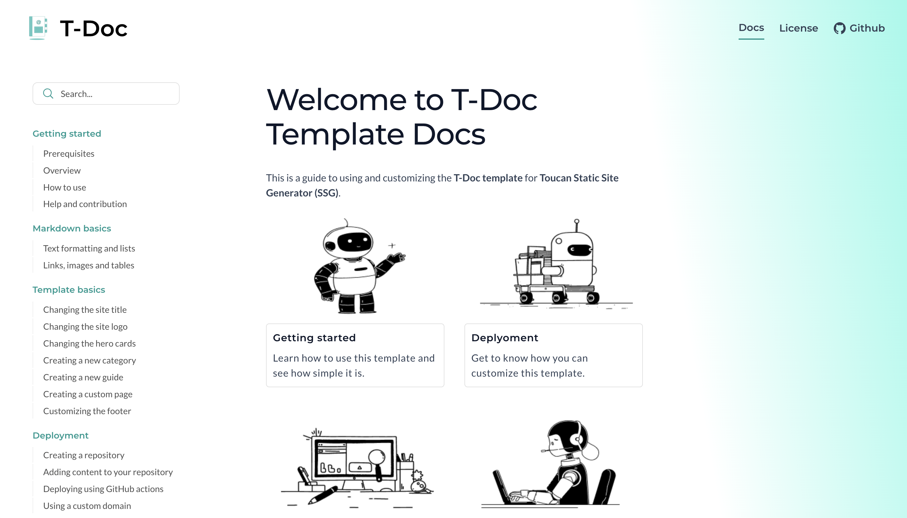

# T-Doc

A sleek, modern documentation template for Toucan. 
Check out the [Demo](https://toucansites.github.io/t-doc-template-demo/)  

[](https://toucansites.github.io/t-doc-template-demo/)

## Introduction

T-Doc is a powerful and flexible documentation template for [Toucan](https://toucansites.com). It is designed to help you create clear, structured, and easy-to-maintain documentation for any type of product, service, or project.

## Toucan template features - All Toucan templates are…

- **Highly Customizable**: Personalize appearance such as color, font, menu, social Links, SEO meta tags, and even more to the preferences of You and your Visitors.
- **Lightning-Fast** by Default (100% [GTMetrix](https://gtmetrix.com/) Performance Score): T-Doc delivers blazing-fast load times, ensuring a seamless experience for every visitor without delays or frustration.
- **Easy to deploy** via GitHub Actions: Your updates go live instantly — no manual overhead.
- **Free Hosting** with GitHub Pages: Deploy your blog without spending a dime on hosting.
- **Markdown-Powered** Content: Write and manage your content effortlessly with Markdown
- **Responsive**: Whether on desktop, tablet, or mobile, this template scales beautifully, ensuring your site looks flawless on any device.
- **SEO-Friendly** including Sitemap: Search engines can index your site efficiently.
- **Support Meta Tags**: Adds [Open Graph](https://ogp.me/) support so shared links display rich, branded previews on social media.
- **Support API** based on your own content: Allowing you to serve structured data or custom endpoints powered by your own content.

### T-Doc template highlights - Plus T-Doc has…

- 4 Pre-Designed Pages
- Dark mode support
- Copy to clipboard button on code snippets
- 2-level hierarchy (category - guide)
- Previous-next navigation in between guides
- Guide outlines (Table of Contents)
- Custom page support
- Searchable and Navigable
- Social links

### **Tech Stack and Core Technologies**

- [Mustache](https://mustache.github.io/) template engine
- [Markdown](https://www.markdownguide.org/)
- Swift
- [HTML](https://www.w3schools.com/html/default.asp)
- CSS
- [YAML](https://yaml.org/)
- [JavaScript](https://www.w3schools.com/js/) (optional) - zero JS by default
  
## Installation

After downloading the template, you have some prerequisites to install. Then you can run it on your localhost. 

**Local setup**

Open the terminal

👉Install dependencies

```
brew install toucansites/toucan/toucan

```

👉Run locally

```
toucan serve & 
toucan watch
```

After that, it will open up a preview of the template in your default browser, watch for changes to source files, and live-reload the browser when changes are saved.

## Roadmap

- Version handling
  
## Resources

- [Live Demo Site](https://toucansites.github.io/t-doc-template-demo/)
- [Live Demo Source Code](https://github.com/toucansites/t-doc-template-demo)
- [About Toucan Templates](https://toucansites.com/docs/templates/)
- [Toucan Installation Guides](https://toucansites.com/docs/installation/)
- [Toucan Getting Started Guides](https://toucansites.com/docs/getting-started/)

## License

- Since T-Doc is free, each template download is valid for multiple websites.
- Redistribution, resale, or transfer of this template is strictly prohibited. Even with modifications to the content, you are not permitted to claim ownership of the design. The original site credit must remain in the footer.
- If you're a web designer, commercial use licenses are available for client projects. This option allows for the removal of footer credits.

## Issue Reporting

- If you encounter any bugs or issues, please submit them directly to our GitHub repository for prompt resolution.

### **Need Custom Development Services?**

Besides developing [Toucan SSG](https://github.com/toucansites/toucan) blazing-fast templates, we help businesses create fast, performance-focused, scalable & secure products using Swift.

If you need complete development services from scratch you can [Hire Us](https://binarybirds.com/contact/).
